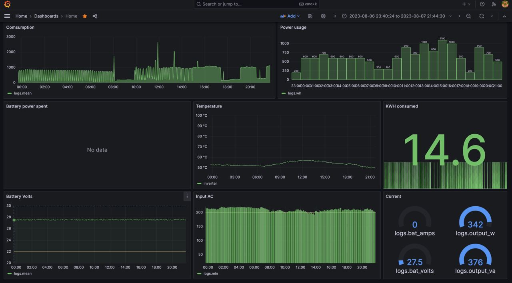

# Home Inverter Grafana Monitor

A home monitoring solution for your MUST (or other modus-compatible) home inverter.

How to use:

1. Prepare a raspberry PI 4 (or any other single-board computer)
2. Connect a USB-B cable to your Inverter USB port
3. Go root (`sudo su`)
4. Install docker & docker-compose on it
   ```bash
   curl -fsSL https://get.docker.com -o get-docker.sh
   chmod +x get-docker.sh
   ./get-docker.sh
   pip3 install docker-compose
   ```
5. Clone this repo
   ```bash
   git clone https://github.com/desertkun/home-inverter-grafana-monitor.git
   cd home-inverter-grafana-monitor
   ```
6. Change `INVERTER_MODEL` on the [compose file](./docker-compose.yml) according to your model.
7. Go into the repo folder and do `docker-compose up -d`
8. Give it 20m to install everything and boot
9. Open `http://<rasperry-ip>:3000` and login with `admin/admin`
10. You should be redirected to an empty list of dashboards. Click New -> Import
11. Select [this file](./home-dashboard.json)



# Supporter Inverters

* MUST PV1800 `must-pv1800`

# But I have different model

1. Figure out the MODBUS device ID of your model, and the BAUD rate.
2. Look up the datasheet for register IDS that correspond to voltages etc,
   as specified in [monitor.py](monitor/monitor.py) (see offsets, e.g. 25200 + register ids)
3. Use [help/modbus.py](./help/modbus.py) script to figure out the register values as they work for you
   ```
   help/modbus.py <register from> <register to>
   # eg
   help/modbus.py 25200 25275
   ```
4. Modify [monitor.py](monitor/monitor.py) to support your  `INVERTER_MODEL`, deploy as usual. Change `INVERTER_MODEL` 
   in the [compose file](./docker-compose.yml).
5. Open a Pul Request so others can benefit from your work.

# I want notifications when power goes out

1. Create a bot on Telegram using https://t.me/BotFather
2. Create a new group with only you and that bot
3. Copy [the group Id](https://stackoverflow.com/a/49852274)
4. Open http://<ip>:3000/alerting/notifications
5. Select telegram as type, fill in token and group id, save the contact point.
   Select Notification policies, Select Default, click Edit, change contact point to Telegram
6. Edit e.g. the Input AC Panel: click Alerts -> Create Alert
7. Change Threshold to BELOW 100.
8. Click SAVE on the Dashboard